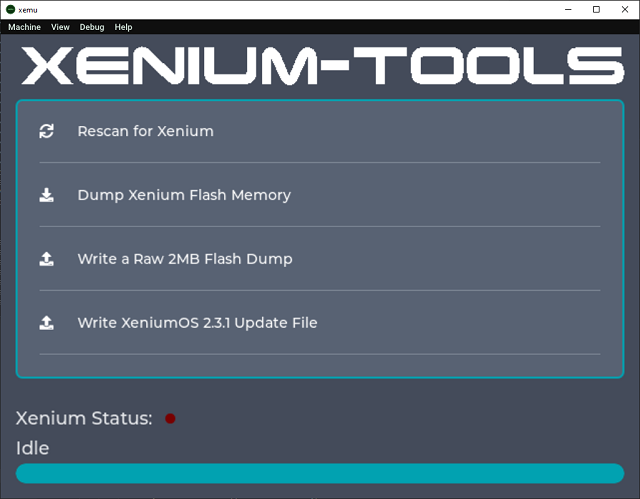

# Xenium-Tools
A tool to perform some basic functions to support the OpenXenium modchip on the Original Xbox console.  
See https://github.com/Ryzee119/OpenXenium.

* Basic detection that the Xenium modchip is working
* Cycle the RGB led
* Dump the full flash memory of the modchip to the Xbox harddrive.
* Write a full flash dump to the Xenium
* Write a XeniumOS v2.3.1 update file to the modchip.



## Build (Original Xbox)
Setup and install [nxdk](https://github.com/XboxDev/nxdk/).
```
make -f Makefile.nxdk NXDK_DIR=/path/to/nxdk
```
