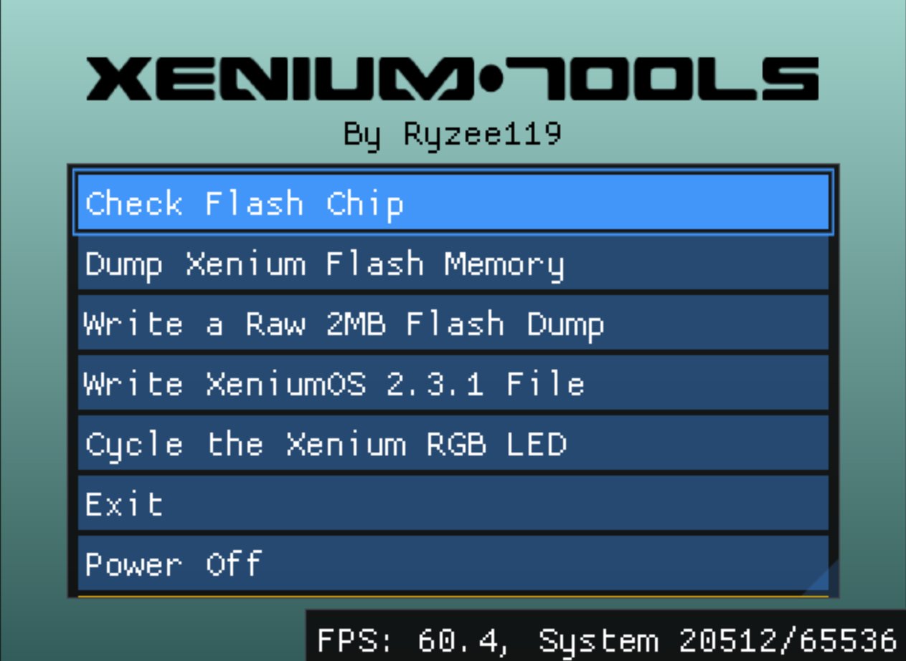

# Xenium-Tools
A tool to perform some basic functions to support the OpenXenium modchip on the Original Xbox console.  
See https://github.com/Ryzee119/OpenXenium.

* Basic detection that the Xenium modchip is working
* Cycle the RGB led
* Dump the full flash memory of the modchip to the Xbox harddrive.
* Write a full flash dump to the Xenium
* Write a XeniumOS v2.3.1 update file to the modchip.



## Build (Original Xbox)
Setup [nxdk](https://github.com/XboxDev/nxdk/) dependancies.
```
git clone --recursive https://github.com/Ryzee119/Xenium-Tools.git
cd lib/nxdk
./bin/active
make NXDK_ONLY=y
make tools
cd ../../
mkdir build && cd build
cmake .. -DCMAKE_TOOLCHAIN_FILE=lib/nxdk/share/toolchain-nxdk.cmake
cmake --build .
```
